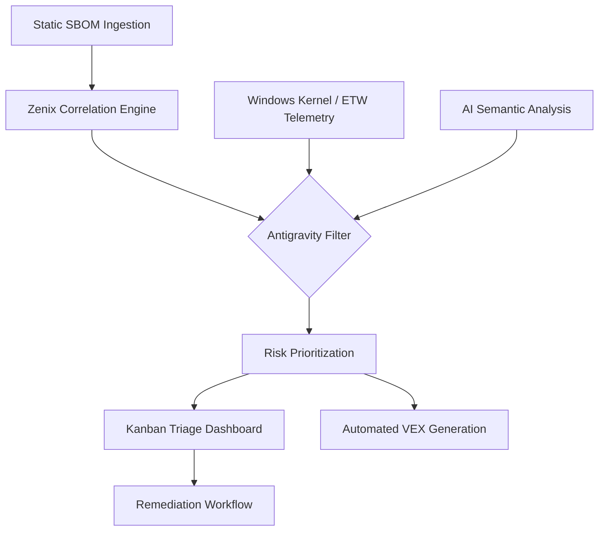

# 🛡️ Zenix – Antigravity SBOM & Contextual Vulnerability Triage

> **Zenix** is a next-generation **Software Supply Chain Security platform** that eliminates vulnerability noise by correlating **SBOM data with real runtime behavior**.  
> Instead of overwhelming security teams with thousands of static alerts, Zenix acts as a **Cognitive Noise Filter**, prioritizing only vulnerabilities that are actually **reachable and exploitable**.

---

# 📖 Overview

Traditional vulnerability scanners create **"Security Gravity"** — a flood of alerts from static dependency scans that security teams cannot realistically triage.

**Zenix introduces an Antigravity Model**, where vulnerabilities are validated against **runtime telemetry, exploit probability, and AI reasoning** before being surfaced.

The platform bridges the gap between:

- Static SBOM analysis  
- Runtime behavior  
- Real-world exploit intelligence  

This results in dramatically **reduced false positives** and **actionable security insights**.

---

# 🎯 Project Objectives

### 1️⃣ Reduce Alert Noise
Eliminate up to **95% of false positives** using **runtime reachability analysis**.

### 2️⃣ Dynamic Context Awareness
Validate whether vulnerable libraries are actually **loaded into memory** using **Windows ETW telemetry**.

### 3️⃣ Detect Shadow Dependencies
Identify **hidden runtime imports** in Python and JavaScript using **AI semantic analysis**.

### 4️⃣ Automate Compliance
Generate machine-readable **VEX (Vulnerability Exploitability eXchange)** reports.

### 5️⃣ Infrastructure Risk Visualization
Visualize the **blast radius of vulnerabilities across systems and networks**.

---

# ✨ Key Features

| Feature | Description |
|------|------|
| **Antigravity Filter** | Suppresses alerts from unreachable code paths |
| **Windows ETW Runtime Agent** | Lightweight telemetry monitoring of runtime library loads |
| **EPSS + KEV Prioritization** | Prioritizes vulnerabilities based on real-world exploit probability |
| **AI Semantic Triage** | Detects hidden runtime dependencies using LLM analysis |
| **Automated VEX Reports** | Generates signed VEX documents for compliance and auditors |
| **Blast Radius Mapping** | Graph-based visualization of vulnerability impact |
| **Threat Map** | Real-time global visualization of malicious IP activity |

---

# 🏗️ System Architecture

Zenix uses a **Layered Context Engine** to correlate multiple security intelligence sources.



---

# 🧠 Core Modules

## 1️⃣ Windows Runtime Agent (ETW)

The runtime agent acts as the **eyes of Zenix** inside the Windows operating system.

It monitors the **Microsoft-Windows-Kernel-Process** ETW provider to detect when software components from the SBOM are actually loaded into memory.

### Capabilities

- Real-time **ImageLoad monitoring**
- Process telemetry collection
- Runtime dependency validation

### Advantage

Provides **eBPF-like visibility for Windows environments**.

---

## 2️⃣ AI Semantic Triage Engine

Static scanners miss many vulnerabilities caused by **dynamic imports**.

Zenix uses **LLM-based semantic analysis** to detect hidden dependencies such as:

```
importlib.import_module()
require()
dynamic package loading
plugin frameworks
```

This allows detection of **Shadow Dependencies** invisible to traditional scanners.

---

## 3️⃣ Multi-Vector Risk Engine

Zenix moves beyond traditional **CVSS scoring**.

It calculates vulnerability risk using multiple real-world signals.

```
Risk Score =
(CVSS × 0.2) +
(EPSS × 0.5) +
(KEV × 0.3) +
(Runtime Reachability)
```

### Inputs Used

- **CVSS** – Severity rating
- **EPSS** – Probability of exploitation
- **KEV** – Known exploited vulnerabilities
- **Runtime Reachability** – Whether the code is actually executed

---

# 🖥️ Interactive Dashboard

The Zenix frontend provides a **security operations interface** designed for vulnerability triage teams.

Built using:

- **React 19**
- **Vite**
- **Graph-based visualization**

### Dashboard Components

| Component | Description |
|------|------|
| **Kanban Board** | Track vulnerability remediation workflow |
| **Reachable Risks Panel** | Displays only exploitable vulnerabilities |
| **Threat Map** | Geospatial view of malicious IP activity |
| **Blast Radius Graph** | Visualizes dependency risk propagation |
| **VEX Generator** | Automated vulnerability justification reports |

---

# 📂 Project Structure

```
zenix-security-platform/
│
├── backend/                    # Python / Flask backend
│   ├── agents/                 # Windows ETW runtime collectors
│   ├── logic/                  # Risk scoring + EPSS/KEV enrichment
│   └── ai/                     # Semantic dependency analysis
│
├── frontend/                   # React 19 + Vite UI
│   └── src/
│       ├── components/
│       │   ├── dashboard-home/
│       │   ├── reachable-risks/
│       │   ├── threat-map/
│       │   └── vex/
│
├── data/                       # Sample SBOM + telemetry datasets
├── requirements.txt
└── README.md
```

---

# ⚙️ Installation

## 1️⃣ Setup Frontend

```bash
cd frontend
npm install
npm run dev
```

The development server will start at:

```
http://localhost:5173
```

---

## 2️⃣ Setup Backend

```bash
cd backend

python -m venv venv

# Linux / Mac
source venv/bin/activate

# Windows
venv\Scripts\activate

pip install -r requirements.txt
```

Start backend server:

```bash
python app.py
```

---

# 🧪 Example Research Case Study

### Scenario: Log4j Vulnerability

**Static Scanner Result**

```
Component: log4j-core.jar
CVE: Critical
```

Traditional scanners mark the system as **high risk**.

---

### Zenix Runtime Validation

The Windows ETW agent checks the **Java process memory map** and detects:

```
log4j-core.jar
Status: Present on disk
Loaded into memory: NO
```

---

### Zenix Decision

```
Reachability: False
Risk Status: Not Exploitable
```

A **VEX report** is generated automatically.

```
Status: Not_Affected
Justification: Component not loaded during runtime
```

The alert is removed from the developer dashboard.

---

# 🔐 Why Zenix Matters

Modern organizations suffer from **SBOM alert fatigue**.

Zenix solves this by introducing:

- Runtime-aware vulnerability triage
- AI-assisted dependency discovery
- Exploit probability prioritization
- Automated compliance documentation

The result is a **dramatic reduction in remediation noise** while focusing security teams on **real threats**.

---

# 🚀 Future Roadmap

Planned enhancements include:

- Linux runtime support using **eBPF**
- Kubernetes workload reachability analysis
- CI/CD pipeline integration
- Real-time SBOM ingestion
- Enterprise policy automation

---

# 📜 License

MIT License

© 2026 **Zenix Security Research Project**