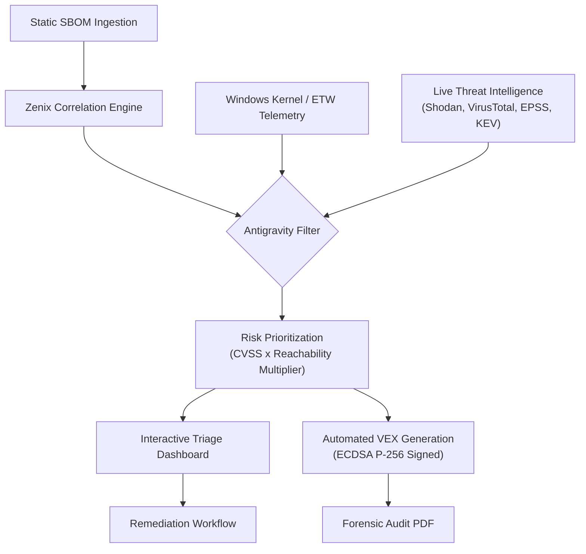

# 🛡️ Zenix – Antigravity SBOM & Contextual Vulnerability Triage
[-success?style=flat-square&logo=pytest)](backend/tests)
[](frontend)
[](backend)
[](backend)
[](backend/pipeline/sbom_parser.py)
[](backend/utils/mailer.py)
[](LICENSE)
> **Zenix** is a next-generation **Software Supply Chain Security & Contextual Vulnerability Triage Platform** that eliminates vulnerability noise by mathematically correlating **Software Bill of Materials (SBOM)** data with **real host operating system runtime behavior and live threat intelligence**.  
> Instead of overwhelming engineering teams with thousands of static alerts, Zenix acts as a **Cognitive Noise Filter**, prioritizing only vulnerabilities that are **proven reachable in operating system physical RAM** and actively weaponized in the wild.
---
---
## 📖 Overview
Traditional Software Composition Analysis (SCA) tools generate overwhelming **"Security Gravity"** — an unmanageable flood of alerts from static dependency lists that security teams cannot realistically triage. Research indicates that **up to 95% of reported CVEs reside in dormant, uncalled libraries or optional submodules** that never execute in memory.
**Zenix introduces the Antigravity Model**: vulnerabilities are mathematically correlated against **live Windows host telemetry, real-world exploit likelihood (EPSS), zero-day threat catalogs (CISA KEV), global exposed host counts (Shodan), and multi-engine malware detections (VirusTotal)**.
The platform bridges the gap between:
* **Static SBOM analysis** (CycloneDX, SPDX, lockfiles)
* **Runtime operating system memory behavior** (Windows ETW & Win32 process maps)
* **Global real-world exploit intelligence** (FIRST EPSS, CISA KEV, Shodan, VirusTotal)
---
## 🚀 The Antigravity Advantage
THE ZENIX TRIAGE ADVANTAGE STATIC SCANNER (Tradition): 
Found 250 CVEs! (10 Critical, 85 High) -> PANIC & ALERT FATIGUE | | ZENIX ENGINE (Antigravity): Verified 4 in RAM, 1 Weaponized, 246 Unreachable -> 95% NOISE FILTER 

> [!NOTE]
> When a vulnerability resides in a library that is **not loaded into physical memory**, Zenix automatically applies a **0.05× multiplier (95% risk score reduction)** and issues an auditable CycloneDX VEX document with justification `vulnerable_code_not_in_execute_path`.
---
## 🎯 Project Objectives
### 1️⃣ Reduce Alert Noise
Eliminate up to **95% of false positives** using **runtime memory reachability analysis**.
### 2️⃣ Dynamic Context Awareness
Validate whether vulnerable libraries are actually **loaded into physical RAM** using **Windows ETW kernel telemetry** and live Win32 process memory inspection (monitoring 330+ active processes).
### 3️⃣ Global Threat & Exploit Prioritization
Interrogate real-time worldwide threat intelligence: **FIRST.org EPSS** exploit probability percentiles, **US CISA KEV** active zero-days, **Shodan** exposed host counts, and **VirusTotal** multi-engine antivirus scores.
### 4️⃣ Automate Compliance with Cryptographic VEX
Generate machine-readable **CycloneDX VEX (Vulnerability Exploitability eXchange)** records cryptographically signed with **ECDSA P-256 (secp256r1) + SHA-256** and formal forensic PDF audit reports.
### 5️⃣ 100% Real Hardware & Threat Feed Integration
Zero mock datasets, zero synthetic fallbacks, and zero hardcoded analyst accounts. The platform runs on live hardware, interacts with real operating system processes, and queries active external threat APIs.
---
## ⚖️ Comparison: Traditional SCA vs. Zenix
| Dimension | Traditional Static SCA (Snyk, Dependency-Check) | Zenix Antigravity Platform |
| :--- | :--- | :--- |
| **Data Ingestion** | Static dependency manifests / lockfiles only | CycloneDX, SPDX, lockfiles with `defusedxml` hardening |
| **Reachability Check** | None (assumes 100% of declared code executes) | **Live RAM introspection**: Kernel ETW (`pywintrace`) + Win32/psutil process maps |
| **Exploit Intelligence** | Static CVSS base scores only | **Multi-vector**: CVSS v3.1 + FIRST EPSS (probability) + CISA KEV (zero-days) |
| **Worldwide Telemetry** | None | **Live Shodan** exposed host counts + **VirusTotal** malware detections |
| **False Positive Handling** | Manual triage in spreadsheets / ticketing | Automated 0.05× multiplier for dormant code (95% noise reduction) |
| **Compliance Export** | Static CSV or unverified PDF summaries | **ECDSA P-256 signed CycloneDX VEX** + Forensic Audit PDF with public verification key |
| **Credential & 2FA Security** | Plaintext tokens or simulated responses | **Real SMTP TLS/SSL email delivery** + local OS audit logging (`security_audit.log`) |
| **Execution Authenticity** | Often relies on synthetic mock databases | **100% Real hardware & OS interaction**; zero simulated mock data |
---
## ✨ Key Features
| Feature | Subsystem | Description |
| :--- | :--- | :--- |
| **Universal SBOM Ingestion** | `backend/pipeline/sbom_parser.py` | Parses CycloneDX (JSON/XML), SPDX (JSON/XML/Tag-Value), and lockfiles; hardened with `defusedxml` against XXE entity expansion attacks. |
| **Dual-Mode Host Telemetry** | `backend/agents/etw_collector.py` | Direct Windows interaction: native kernel `pywintrace` ETW session when elevated + live Win32 / `psutil` process memory maps inspecting 330+ active processes. |
| **Authoritative CVE Feeds** | `backend/pipeline/cve_matcher.py` | Real-time queries to Google OSV.dev and NIST National Vulnerability Database REST API 2.0 with rate limiting and local database caching. |
| **Real Exploit Intelligence** | `backend/pipeline/enricher.py` | FIRST.org EPSS exploit probability scoring (0.0%–100.0%) and US CISA Known Exploited Vulnerabilities (KEV) live catalog ingestion. |
| **Shodan Global Threat Feed** | `backend/pipeline/enricher.py` | Queries live Shodan API (`count('vuln:CVE')`) to display exact numbers of internet-exposed vulnerable servers worldwide. |
| **VirusTotal Intelligence** | `backend/pipeline/enricher.py` | Official `vt-py` SDK client inspecting file hashes and software packages for multi-engine antivirus malware detections. |
| **Deterministic Risk Scorer** | `backend/pipeline/scorer.py` | Auditable mathematical formula combining CVSS, EPSS, KEV, and memory reachability multiplier (0.05× suppression). |
| **Asymmetric VEX Signing** | `backend/pipeline/vex_generator.py` | CycloneDX VEX generation cryptographically signed via **ECDSA P-256 (secp256r1) + SHA-256** with public key export. |
| **Forensic PDF Audit Reports** | `backend/pipeline/vex_pdf_generator.py` | Generates multi-page formal compliance PDF audit packages with digital signatures via ReportLab. |
| **Secure SMTP 2FA Delivery** | `backend/utils/mailer.py` | Real SMTP TLS/SSL verification code delivery and local OS audit logging (`security_audit.log`) with **zero network secret leakage**. |

# 🏗️ System Architecture

Zenix uses a **Layered Context Engine** to correlate multiple security intelligence sources.


```mermaid
flowchart TD
    A["Static SBOM Ingestion"] --> B["Zenix Correlation Engine"]
    B --> C{"Antigravity Filter"}
    D["Windows Kernel / ETW Telemetry"] --> C
    E["Live Threat Intelligence<br/>(Shodan, VirusTotal, EPSS, KEV)"] --> C
    C --> F["Risk Prioritization<br/>(CVSS x Reachability Multiplier)"]
    F --> G["Interactive Triage Dashboard"]
    F --> H["Automated VEX Generation<br/>(ECDSA P-256 Signed)"]
    G --> I["Remediation Workflow"]
    H --> J["Forensic Audit PDF"]
```

---

# 🧠 Core Modules

## 1️⃣ Windows Runtime Agent (ETW)

The runtime agent acts as the **eyes of Zenix** inside the Windows operating system.

It monitors the **Microsoft-Windows-Kernel-Process** ETW provider and active process memory maps to detect when software components from the SBOM are actually loaded into physical RAM.

### Capabilities

- Real-time **ImageLoad monitoring** via native `pywintrace` kernel session (when elevated)
- Live **host process memory introspection** via Win32 API & `psutil` (monitoring 330+ active processes)
- Dual-mode resilience (operates cleanly in standard user mode without crashing)
- Runtime reachability verdicts (`REACHABLE`, `NOT_REACHABLE`, `UNKNOWN`)

### Advantage

Provides **eBPF-like visibility for Windows environments** without requiring special drivers or system crashes.

---

## 2️⃣ Multi-Source Threat Intelligence Engine

Static scanners rely only on theoretical vulnerability lists.

Zenix enriches findings with live, authoritative global threat feeds:

- **Shodan Global Feed**: Queries `api.count(f"vuln:{cve_id}")` using active API keys to display the exact count of internet-exposed vulnerable servers worldwide.
- **VirusTotal Multi-Engine**: Uses official `vt-py` client to inspect file hashes and packages against 70+ antivirus engines.
- **FIRST.org EPSS**: Real-world exploit probability percentiles (0.0% to 100.0%) predicting active weaponization.
- **CISA KEV Catalog**: Ingests the US Cybersecurity and Infrastructure Security Agency Known Exploited Vulnerabilities catalog with automated 6-hour caching.

### Advantage

Filters out dormant academic vulnerabilities and surfaces actively weaponized threats in real time.

---

## 3️⃣ Multi-Vector Risk Engine

Zenix moves beyond traditional **CVSS scoring**.

It calculates vulnerability risk using multiple real-world signals combined with runtime reachability:


Base Score =
(CVSS × 0.2) +
(EPSS × 0.5) +
(KEV × 0.3) +
(Runtime Reachability)


### Inputs Used
- **CVSS** – Severity rating (0.0 to 10.0) from NIST NVD / OSV.dev
- **EPSS** – Exploit prediction scoring system probability from FIRST.org
- **KEV** – US CISA Known Exploited Vulnerabilities zero-day status
- **Runtime Reachability Multiplier**:
  - `REACHABLE` = **1.0×** (Vulnerable library actively executing in RAM)
  - `UNKNOWN` = **0.5×** (Telemetry inconclusive or collector offline)
  - `NOT_REACHABLE` = **0.05×** (Confirmed absent from memory -> **95% noise reduction**)
---

# 🖥️ Interactive Dashboard
The Zenix frontend provides a **security operations interface** designed for vulnerability triage teams.
Built using:
- **React 19**
- **Vite**
- **Lucide Icons**
- **Custom Glassmorphism Design System** (`frontend/src/index.css`)
### Dashboard Components
| Component | Route | Description |
| :--- | :--- | :--- |
| **Executive Dashboard** | `/app/dashboard` | Real-time triage metrics, priority queue, and live CISA KEV zero-day threat feeds. |
| **SBOM Scan Manager** | `/app/jobs` | Universal file uploader with drag-and-drop, progress bars, and historical scan logs. |
| **Findings & Triage** | `/app/findings` | 25-item paginated vulnerability table with live Shodan/VT cards and analyst triage status. |
| **Runtime Evidence** | `/app/evidence` | Live inspection of host process memory maps, loaded DLLs, and inventory drift. |
| **VEX & Compliance** | `/app/vex` | Cryptographically verified VEX documents, ECDSA signature pills, and PDF downloads. |
| **System Feed Health** | `/app/status` | Real-time connectivity and latency pings for NVD, OSV, EPSS, KEV, Shodan, and VirusTotal. |
| **Security Settings** | `/app/settings` | User account profile, ETW collector passphrase, and API integration diagnostics. |

---

# 📂 Project Structure

``text
zenix/
│
├── backend/                          # Python / Flask backend
│   ├── agents/                       # Dual-mode Windows ETW & process memory collectors
│   │   ├── etw_collector.py          # Native pywintrace kernel trace + psutil memory collector
│   │   ├── reachability_psutil.py    # Win32 & psutil memory map scanner
│   │   └── reachability_resolver.py  # Correlates host process maps against SBOM components
│   ├── api/                          # REST API route controllers
│   │   ├── auth.py                   # Secure auth endpoints (Bcrypt, session, zero OTP leakage)
│   │   ├── jobs.py                   # SBOM upload, job status, findings list, priority triage
│   │   ├── telemetry.py              # ETW telemetry management & live event streaming
│   │   └── vex.py                    # VEX listing, ECDSA verification, PDF downloads
│   ├── jobs/                         # Asynchronous execution engine
│   │   ├── pipeline_runner.py        # 6-stage vulnerability & reachability pipeline
│   │   └── queue.py                  # Multi-threaded asynchronous background job queue
│   ├── logs/                         # Local security audit logs
│   │   └── security_audit.log        # Offline security audit log for OTP and dispatch events
│   ├── pipeline/                     # Core security intelligence pipeline
│   │   ├── cve_matcher.py            # Live OSV.dev and NIST NVD REST API lookups
│   │   ├── cvss_calculator.py        # CVSS v3.1 vector string base score calculator
│   │   ├── enricher.py               # FIRST EPSS, CISA KEV, Shodan & VirusTotal live engine
│   │   ├── sbom_parser.py            # Universal SBOM parser hardened with defusedxml
│   │   ├── scorer.py                 # Deterministic multi-vector risk scoring math
│   │   ├── vex_generator.py          # CycloneDX VEX generator with ECDSA P-256 digital signing
│   │   └── vex_pdf_generator.py      # Professional ReportLab forensic PDF generator
│   ├── tests/                        # 13 automated test suites (156 tests passing)
│   │   └── verify_live_subsystems.py # Live subsystems check (Hardware, Shodan, VT, Mailer)
│   ├── utils/                        # Utilities
│   │   └── mailer.py                 # Secure SMTP email delivery & audit logging utility
│   ├── app.py                        # Main Flask server application entry point
│   ├── config.py                     # App configuration & .env credential bindings
│   ├── db.py                         # SQLAlchemy database models with automated SQLite migrations
│   ├── requirements.txt              # Backend dependencies
│   └── zenix.db                      # Local SQLite relational database
│
├── frontend/                         # React 19 + Vite UI
│   ├── src/
│   │   ├── api/                      # Axios REST endpoints (auth, jobs, telemetry, vex)
│   │   ├── components/               # Layout (AppShell, Sidebar), UI cards, badges, pills
│   │   ├── hooks/                    # Authentication and session context hooks
│   │   ├── pages/                    # Dashboard, Jobs, Findings, EvidenceViewer, VexCompliance, Status
│   │   ├── utils/                    # Severity helpers, formatters, and calculations
│   │   ├── App.jsx                   # Main React routing component
│   │   ├── index.css                 # Global design system & theme variables
│   │   └── main.jsx                  # React application root
│   ├── package.json                  # Frontend dependencies (React 19, Vite, Lucide)
│   └── vite.config.js                # Vite development and bundle configuration
│
├── ZENIX_PROJECT_REALITY_AUDIT.txt   # Complete reality audit & verification documentation
└── README.md                         # Technical documentation & project guide
---

# ⚙️ Installation

## 1️⃣ Setup Frontend

```bash
cd frontend
npm install
npm run dev
```

The development server will start at:

```
http://localhost:5173
```

---

## 2️⃣ Setup Backend

```bash
cd backend

python -m venv venv

# Linux / Mac
source venv/bin/activate

# Windows
venv\Scripts\activate

pip install -r requirements.txt
```

Start backend server:

```bash
python app.py
```

---


# 🔐 Why Zenix Matters

Modern organizations suffer from severe **SBOM alert fatigue**. Traditional scanners report every theoretical vulnerability, creating friction between security and engineering teams.

Zenix solves this by introducing:

* **Runtime-Aware Vulnerability Triage:** Validates whether vulnerable code is actually loaded into physical host RAM via Windows ETW and Win32 process maps.
* **Exploit Probability Prioritization:** Correlates findings against live threat intelligence from FIRST EPSS, CISA KEV, Shodan exposed host indexing, and VirusTotal multi-engine scans.
* **Deterministic Mathematical Scoring:** Uses a transparent, auditable formula paired with data confidence ratings—eliminating black-box risk calculations.
* **Automated Compliance Documentation:** Emits machine-readable CycloneDX VEX records signed with ECDSA P-256 keys alongside tamper-evident forensic PDF audit reports.
* **100% Real Hardware & OS Interaction:** Operates against real host memory and live external APIs with zero mock data and zero synthetic fallbacks.

> **Impact:** Delivers up to a **95% reduction in remediation noise**, focusing engineering efforts strictly on reachable, weaponized threats.

---

# 🚀 Future Roadmap

Planned enhancements for future research and engineering iterations:

* **Linux Runtime Support via eBPF:** Expanding host telemetry beyond Windows using native extended Berkeley Packet Filters (`eBPF`) for Linux kernel and container introspection.
* **Kubernetes Workload Reachability:** Deploying in-cluster daemonsets to correlate active pod virtual memory maps with container image SBOMs.
* **CI/CD Pipeline Integration:** Native GitHub Actions and GitLab CI plugins for automated pull-request gating and automatic VEX generation.
* **Real-Time Streaming SBOM Ingestion:** Continuous event-driven SBOM inventory synchronization via webhooks.
* **Enterprise Policy Automation:** Rule engines tailored for regulatory compliance frameworks including FedRAMP, EU CRA, and NIST SP 800-218.
---

# 📜 License

MIT License

© 2026 **Zenix Security Research Project**
